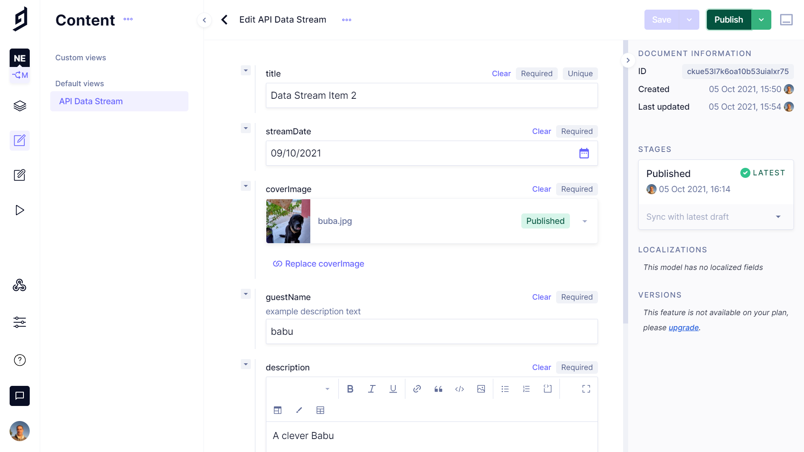

# :zap: Next GraphQL GraphCMS

* A Next.js React app using Apollo GraphQL Client to fetch data from a GraphCMS (Hygraph) API.
* **Note:** to open web links in a new window use: _ctrl+click on link_


## :page_facing_up: Table of contents

* [:zap: Next GraphQL GraphCMS](#zap-next-graphql-graphcms)
  * [:page_facing_up: Table of contents](#page_facing_up-table-of-contents)
  * [:books: General Info](#books-general-info)
  * [:camera: Screenshots](#camera-screenshots)
  * [:signal_strength: Technologies](#signal_strength-technologies)
  * [:floppy_disk: Setup](#floppy_disk-setup)
  * [:computer: Code Examples](#computer-code-examples)
  * [:clipboard: Status & To-Do List](#clipboard-status--to-do-list)
  * [:clap: Inspiration](#clap-inspiration)
  * [:file_folder: License](#file_folder-license)
  * [:envelope: Contact](#envelope-contact)

## :books: General Info

* **GraphQL** is a Query Language for storing & querying data, an alternative to traditional protocols such as REST API. GraphQL allows the client to request ONLY the data it needs from the server.
* The **GraphCMS headless Content Management System (CMS)** uses GraphQL to query data and perform mutations (updates). Here an API is created and accessed from a Next.js frontend. A query is created in the GraphCMS Playground.
* **GraphQL with GraphCMS** is good for blogs, e-commerce, Customer Relationship Management (CRM) & productivity software, simple apps & websites
* **Headless** means that content data is created using a schema, then managed & stored as a standalone component without presentation logic.
* **Next.js** is for server-rendered react apps. It has automatic code splitting, simple page-based routing, built-in CSS support and hot reloading. Every component file in the pages folder is treated as a page
* Home page shows list of posts (streams), Clicking on a stream link navigates to a post detail page.

## :camera: Screenshots

.

## :signal_strength: Technologies

* [Node.js v14](https://nodejs.org/) javascript runtime using the [Chrome V8 engine](https://v8.dev/).
* [React v18](https://reactjs.org/) Javascript library.
* [GraphQL v16](https://github.com/graphql/graphql-js)
* [GraphCMS](https://graphcms.com/) production-ready Content API within minutes
* [Apollo v2](https://www.apollographql.com/) GraphQL implementation data graph layer
* [Apollo Client v3](https://www.npmjs.com/package/apollo-client) fully-featured caching GraphQL client
* [Next v12](https://nextjs.org/) minimalist framework for rendering react apps on the server.

## :floppy_disk: Setup

* GraphCMS endpoint needs to be added to `apolloClient.js`
* `npm run dev` runs the app in the development mode. Open [http://localhost:3000](http://localhost:3000) to view it in the browser.
* `npm run build` builds the app for production to the `build` folder. It correctly bundles React in production mode and optimizes the build for the best performance. The build is minified and the filenames include the hashes.

## :computer: Code Examples

* extract of tba

```javascript
tba
```

## :clipboard: Status & To-Do List

* Status: Working - Basic. displays data from GraphCMS backend in Next.js frontend.
* To-Do: Change image to next/image, Add data and change GraphQL schema to my blog. Add documentation & comments.

## :clap: Inspiration

* [GraphCMS Example Projects](https://github.com/GraphCMS/graphcms-examples)

## :file_folder: License

* This project is licensed under the terms of the MIT license.

## :envelope: Contact

* Repo created by [ABateman](https://github.com/AndrewJBateman), email: gomezbateman@yahoo.com
